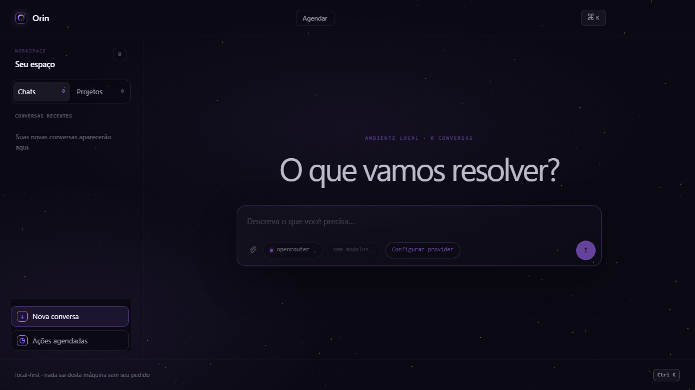
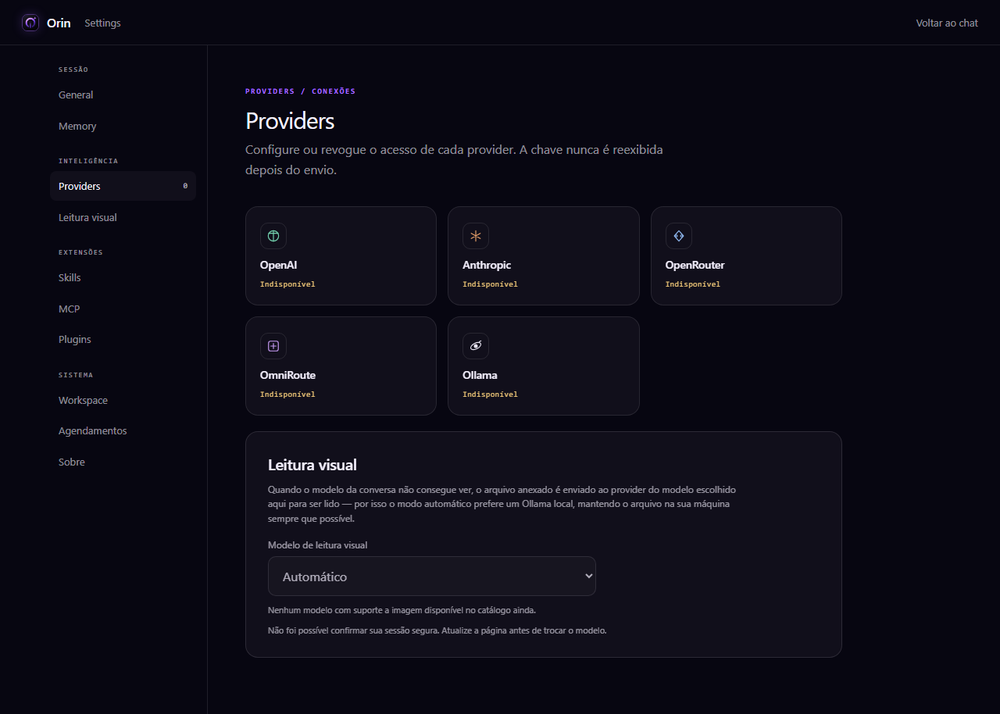
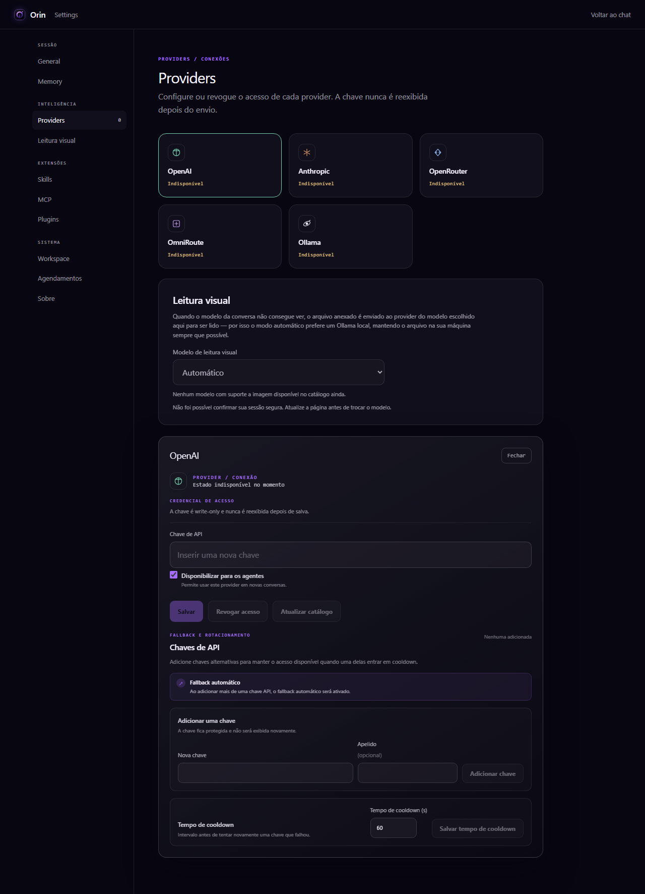
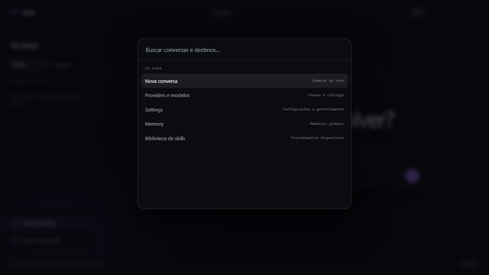
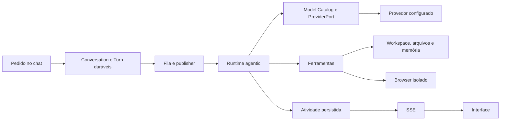

# Orin

## Seu workspace local-first para transformar pedidos em execução visível

Orin é um workspace de agentes de IA orientado a conversas, projetos e execução rastreável. Você descreve o que precisa, acompanha as decisões e as ferramentas em tempo real e mantém o contexto organizado no seu próprio computador.

Ele combina chat durável, ferramentas para arquivos e comandos, busca semântica no código, memória, multiagentes, Skills, MCP, browser isolado e provedores de modelos em uma única experiência.

[Instalar no Windows](#download-e-instalação) · [Ver releases](https://github.com/carlos-edu2367/orin/releases) · [Arquitetura](#arquitetura)

> Status: projeto ativo em desenvolvimento. O perfil local é adequado para uso local; não é uma declaração de prontidão para produção ou de segurança completa.



*A conversa é o ponto de partida: projeto, contexto e ações ficam próximos do pedido.*

## Por que usar o Orin?

- **Execução visível:** cada turno pode mostrar ferramentas, subagentes, arquivos alterados e atividade em streaming. A ação de parar fica disponível durante a execução.
- **Local-first:** dados, conversas, memória e índices ficam no ambiente local. Somente chamadas aos provedores que você configurar saem da máquina.
- **Um workspace para o trabalho real:** projetos podem apontar para uma pasta local, compartilhar contexto com conversas e servir de base para busca, comandos e tarefas agendadas.
- **Liberdade de modelo:** o catálogo e as portas de provedor uniformizam streaming, tool calls, visão, cancelamento, uso e erros sem prender o fluxo a uma única API.
- **Instalação simples:** a release para Windows já inclui runtime, SQLite e Chromium. O uso instalado não exige Python, Node.js, Docker, PostgreSQL ou Redis.
- **Extensível:** ferramentas nativas, Skills versionadas, MCP, plugins e browser isolado permitem adaptar o agente ao seu processo.

## Veja o Orin em ação

### Configure seus provedores

O Orin organiza os provedores em um catálogo visual, separa local/cloud e mostra o estado de cada conexão.



As credenciais são armazenadas de forma criptografada e os campos de chave são write-only. Ao cadastrar mais de uma chave de API, o fallback automático pode ser ativado para manter o fluxo resiliente.



### Acesse ações rapidamente

O command palette concentra navegação, conversas, projetos e ações frequentes sem tirar o foco do trabalho.



## Download e instalação

O caminho recomendado para Windows é instalar a release mais recente diretamente pelo PowerShell:

```powershell
irm https://github.com/carlos-edu2367/orin/releases/latest/download/install.ps1 | iex
```

O instalador:

1. baixa a release estável mais recente;
2. valida o hash SHA-256 dos artefatos;
3. instala o runtime local e o Chromium usado pelo browser do agente;
4. oferece a criação de atalho na Área de Trabalho;
5. adiciona `orin` ao PATH do usuário.

Abra um novo terminal e inicie o workspace:

```powershell
orin
```

O launcher prepara o SQLite local, executa as migrações, inicia a API, os workers, o scheduler e a interface web. Em seguida, aguarda as verificações de prontidão e abre o navegador.

Comandos úteis:

```powershell
orin status       # mostra o estado dos serviços
orin logs         # acompanha os logs do launcher e serviços
orin restart      # reinicia o perfil local
orin stop         # encerra os serviços
orin --desktop    # abre a mesma aplicação no Electron
orin --uninstall  # remove a instalação
```

As versões e os artefatos assinados por hash ficam na página de [releases do Orin](https://github.com/carlos-edu2367/orin/releases). A release para Windows é independente de uma instalação local de Python, Node.js ou Docker.

## Primeiro fluxo

1. Instale e execute `orin`.
2. Crie ou selecione um projeto e associe a pasta de trabalho quando precisar operar sobre código ou arquivos.
3. Abra **Settings → Providers**, configure um provedor e atualize o catálogo de modelos.
4. Inicie uma conversa explicando o objetivo, restrições e resultado esperado.
5. Observe o agente analisar contexto, chamar ferramentas, consultar memória ou delegar partes do trabalho.
6. Revise a atividade, os arquivos e a resposta final. Durante um turno, use **Stop** para interromper a execução.

O turno é persistido. Se a página for recarregada, a conversa continua disponível; o histórico e a atividade ao vivo são tratados como partes diferentes da experiência, evitando que a execução esconda a conversa.

## Fluxos do Orin

### Conversa normal



A API recebe e persiste o pedido. O worker publica e executa o turno fora do processo HTTP. O runtime monta o contexto, resolve o modelo, chama o provedor, executa ferramentas e registra eventos. A interface observa a atividade por SSE.

### Projetos e arquivos

Um projeto pode ser vinculado a uma pasta local. A busca, os comandos, os anexos e as tarefas agendadas podem usar esse workspace compartilhado. Arquivos criados ou alterados ficam sujeitos às permissões e aos limites definidos pelo runtime; o texto de uma resposta do modelo não é a fonte de verdade para autorização.

### Tarefas agendadas

Uma tarefa agendada materializa um novo turno na conversa e no workspace escolhidos. O scheduler não executa o agente diretamente: ele cria a ocorrência durável, e o mesmo publisher/worker/runtime usado pelo chat normal processa o turno. Isso mantém o comportamento, as ferramentas e o histórico alinhados entre execução manual e automática.

### Multiagentes

Um agente principal pode criar especialistas e delegar tarefas com `create_agent`, `ask_agent` e `ask_agents`. Cada subagente recebe um contexto próprio e retorna mensagens ou resultados ao fluxo pai; ele não recebe automaticamente toda a conversa do usuário. Isso permite dividir pesquisa, implementação, revisão ou análise sem perder a visão do trabalho principal.

### Anexos e visão

Anexos entram no contexto como referências locais. Texto pode ser extraído localmente; imagens e páginas digitalizadas podem ser enviadas ao modelo configurado quando o provedor suporta visão. O transporte respeita o provedor e o modelo selecionados, sem expor chaves na interface, nos eventos ou nos logs.

### Browser isolado

Quando habilitado, cada turno usa um Chromium isolado para navegar e produzir atividade visual. O conjunto de ações é limitado: o agente não recebe um navegador pessoal, cookies da sua sessão ou acesso irrestrito ao computador. A interface pode exibir capturas e metadados seguros do trabalho realizado.

### Skills, MCP e plugins

Skills descrevem workflows reutilizáveis e versionados. MCP e plugins acrescentam ferramentas externas por meio de contratos próprios, com aprovação e escopo controlados pelo runtime. Credenciais são fornecidas pelo usuário nas configurações da integração; uma descrição em prompt não concede permissão.

## Diferenciais técnicos

| Capacidade | O que existe no Orin |
| --- | --- |
| Busca semântica | `search_code` e `project_map` indexam o workspace e permitem encontrar trechos pelo significado, não apenas por texto literal. |
| Embeddings e vetores | O modo padrão usa o Ollama local com `nomic-embed-text`; os vetores derivados ficam em um SQLite separado por projeto. O índice é incremental e não substitui a fonte original dos arquivos. |
| Fallback de retrieval | Se o embedder não estiver disponível, o sistema usa BM25 lexical e sinaliza essa condição. O modo remoto é explícito e envia conteúdo indexado para o endpoint configurado. |
| Memória durável | `remember` e `recall` armazenam e recuperam fatos relevantes dentro do escopo do usuário, sem misturar automaticamente o contexto de outros usuários. |
| Multiagentes | Criação, delegação e consulta de subagentes com contexto isolado e retorno para o agente pai. |
| Catálogo de modelos | Descritores de modelo e capacidades orientam seleção, streaming, tool calls, visão, custo, status, primário/fallback e explicação da escolha. |
| Provedores | Adapters para OpenAI, Anthropic, OpenRouter, Ollama Local/Cloud e OmniRoute, preservando uma interface comum para o runtime. |
| Execução observável | Turnos, atividade, uso de ferramentas, cancelamento e streaming são tratados como partes duráveis/observáveis do fluxo. |
| Browser seguro | Chromium isolado por turno, com ações deliberadamente restritas e feedback visual. |
| Extensibilidade | Skills, MCP e plugins podem ampliar capacidades sem acoplar o núcleo a uma integração única. |

### Embeddings locais, com transparência

Para habilitar a busca semântica no perfil local, instale o Ollama e baixe o modelo de embedding:

```powershell
ollama pull nomic-embed-text
```

O padrão é `ORIN_RETRIEVAL_EMBEDDER=ollama`, com chamadas para o Ollama local. O indexador ignora, entre outros, arquivos `.env*`, `.git`, `node_modules`, ambientes virtuais, builds e lockfiles. Há limites por arquivo e por projeto para manter o índice previsível.

Se você configurar `ORIN_RETRIEVAL_EMBEDDER=remote`, o conteúdo necessário para indexar será enviado ao endpoint remoto definido. Essa é uma decisão explícita de privacidade, não um comportamento oculto do modo local. Consulte [docs/RETRIEVAL.md](docs/RETRIEVAL.md) para todos os parâmetros.

## Arquitetura

```text
Browser web / Electron
          │ HTTP + SSE
          ▼
FastAPI gateway ────────► SQLite local + migrações
          │                         ▲
          │                         │ conversas, turnos, atividade,
          │                         │ memória, agentes e fila
          ▼                         │
Publisher ─────► Chat worker ───────┘
                     │
                     ▼
              Agentic Session / Runtime
                 ├── Model Catalog → ProviderPort → provedor
                 ├── Tool Runtime → arquivos, comandos, memória
                 ├── Subagentes
                 ├── Browser worker isolado
                 └── MCP / plugins / Skills
                     │
                     ▼
              atividade persistida → SSE → interface
```

As fronteiras principais são:

- **Gateway:** valida requisições, expõe API/SSE e serve a aplicação web; não executa turnos longos dentro do request HTTP.
- **Persistência:** no runtime instalado, SQLite é a base durável local para conversas, turnos, atividade, memória, agentes e fila. O retrieval usa um índice derivado separado por projeto.
- **Publisher, worker e scheduler:** o publisher coloca turnos no fluxo durável, o worker executa conversas e o scheduler materializa ocorrências de chats agendados.
- **Runtime:** monta contexto, resolve modelo, chama o adapter do provedor, executa ações de ferramenta, registra checkpoints e finaliza o turno.
- **ProviderPort/Model Catalog:** mantém o núcleo independente do formato específico de cada provedor e centraliza capacidades e políticas de seleção.
- **Atividade/SSE:** eventos seguros e limitados são persistidos e transmitidos para a UI; a UI observa o estado, mas não é a autoridade de autorização.
- **Electron:** é uma casca opcional para a mesma aplicação servida pela API local. O launcher continua responsável pelo ciclo de vida dos serviços; o desktop não carrega uma página `file://` isolada.

As decisões de arquitetura e os contratos de evolução estão documentados em [docs/adr](docs/adr), [docs/architecture](docs/architecture) e [docs/LAUNCHER.md](docs/LAUNCHER.md).

### Estrutura do código

```text
src/agentos/api/             gateway HTTP, SSE e rotas
src/agentos/conversations/   conversas e turnos duráveis
src/agentos/agentic/         sessão, runtime, ferramentas e agentes
src/agentos/workers/         publisher, chat worker e scheduler
src/agentos/retrieval/       indexação semântica e lexical
frontend/                    SPA React/Vite
desktop/                     shell Electron opcional
docs/                        arquitetura, ADRs e runbooks
```

## Segurança e limites importantes

- O perfil local escuta em `127.0.0.1` por padrão. Não exponha a porta por proxy reverso, túnel ou encaminhamento sem revisar autenticação, autorização, CSRF e isolamento de dados.
- Chaves de provedores são criptografadas em repouso, write-only na API e não devem aparecer em respostas, eventos ou logs. Proteja `AGENTOS_PROVIDER_ENCRYPTION_KEY` como um segredo do ambiente.
- Páginas abertas pelo browser do agente são conteúdo não confiável. O conjunto local de ações não permite usar senhas pessoais, cookies da sua sessão, submissões arbitrárias ou JavaScript irrestrito.
- A busca remota de embeddings envia conteúdo indexado para o endpoint escolhido. Use o modo Ollama local quando esse conteúdo não puder sair da máquina.
- O projeto ainda está em desenvolvimento ativo. Revise o perfil de implantação e o [runbook de E2E](docs/agentic/E2E_RUNBOOK.md) antes de avaliar uso em produção.

## Desenvolvimento a partir do código-fonte

Para desenvolvimento, use Python 3.13+, Node.js 20+ e Docker Desktop quando precisar dos serviços de integração documentados. Para o perfil local completo:

```powershell
Copy-Item .env.local.example .env.local
Copy-Item frontend/.env.local.example frontend/.env.local
.\scripts\install-orin.ps1
orin
```

O script cria o ambiente Python, instala o projeto, prepara o frontend e configura o runtime local. A chave de criptografia pode ser gerada com:

```powershell
python -c "from cryptography.fernet import Fernet; print(Fernet.generate_key().decode())"
```

Para trabalhar apenas no frontend:

```powershell
Set-Location frontend
npm ci
npm run dev -- --host 127.0.0.1
```

## Validação

```powershell
# Backend unitário
python -m pytest -q tests/unit

# Frontend
Set-Location frontend
npm test
npm run lint
npm run build
npm run test:e2e

# Volte à raiz para cenários de integração, quando o ambiente estiver preparado
Set-Location ..
python -m pytest -q tests/integration
```

Os cenários de integração que dependem de serviços adicionais e os testes visuais estão descritos em [docs/agentic/E2E_RUNBOOK.md](docs/agentic/E2E_RUNBOOK.md). O ambiente usado para validar uma mudança local pode não conter todos esses serviços.

## Documentação útil

- [Launcher e ciclo de vida local](docs/LAUNCHER.md)
- [Busca semântica, embeddings e vetores](docs/RETRIEVAL.md)
- [MCP](docs/MCP.md)
- [Plugins](docs/PLUGINS.md)
- [Criação de Skills](docs/CREATING_SKILLS.md)
- [Provider ports e catálogo de modelos](docs/adr/010-provider-ports-and-model-catalog.md)
- [Contratos de API e SSE](docs/architecture/700-api-security/701-api-sse.md)
- [Runtime](docs/architecture/100-kernel/101-runtime.md)
- [Issues e releases](https://github.com/carlos-edu2367/orin)

## Licença

Orin é distribuído sob a [licença MIT](LICENSE).
