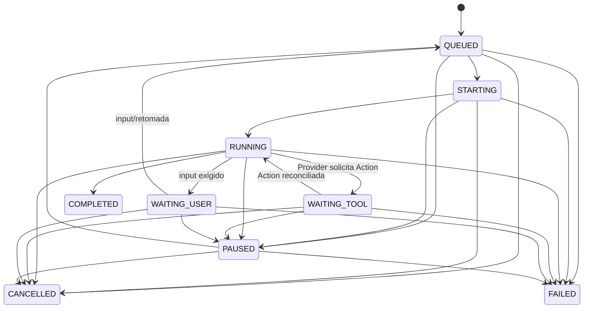

# Backend Discovery — AgentOS

## Escopo e método

Foram inspecionados `src/agentos/api`, `execution`, `runtime`, `events`, `multi_agent`, `tool_runtime`, `providers`, `agents`, `memory`, `artifact_storage`, `workspaces`, `filesystem`, `terminal`, `browser`, `capabilities`, `workers` e `scheduler`, além dos testes unitários e das RFCs. As RFCs esclarecem a intenção; as afirmações abaixo dependem do código executável e de seus testes.

## O que está efetivamente exposto por HTTP/SSE

O gateway FastAPI registra `POST /v1/executions`, controle e input, leituras genéricas de executions/agents/capabilities/tools/workspaces/artifacts/memories, configuração de providers e três rotas de stream. O arquivo `src/agentos/api/contracts.py` deixa claro que query/resource são Protocols sem DTO público concreto. Portanto, forma detalhada de `GET /v1/{resource}` depende do adapter ainda não composto.

| Recurso | Contrato HTTP implementado | Observação importante |
| --- | --- | --- |
| Execution | `POST /v1/executions`, `POST /v1/executions/{id}/control`, `POST /v1/executions/{id}/input`, `GET` item/lista | Comandos retornam recibo `202`, não resultado final. |
| Providers | `PUT/GET/DELETE /v1/providers/{openai|anthropic|openrouter}` | A chave entra somente no `PUT`; a resposta filtra nomes de campos secretos. |
| Resources | `GET /v1/{agents,capabilities,tools,workspaces,artifacts,memories}` e `/{id}` | Não há mutações, paginação tipada nem schema de resposta no gateway. |
| SSE | abrir, ler replay e conectar em stream | Requer seleção explícita de executions; não existe feed global. |
| Ausentes | Agent versions, delegations, scheduler, workers, terminal, browser e download de artifact | Existem no domínio, não em rota pública implementada. |

Todo request protegido usa sessão cookie com CSRF+Origin ou Bearer PAT; mutações exigem `Idempotency-Key`. O cliente não controla ownership, `user_id`, correlação ou credencial. Erros têm envelope sanitizado com `message_key`, `correlation_id`, `retryable` e `retry_after`.

## Lifecycle de Execution confirmado

Estados persistidos em `src/agentos/execution/models.py`:

`QUEUED → STARTING → RUNNING → WAITING_TOOL → RUNNING`, `RUNNING → WAITING_USER`, `RUNNING/WAITING_* → PAUSED`, e terminais `COMPLETED`, `FAILED`, `CANCELLED`. `PAUSED → QUEUED` modela retomada, não uma continuação visual implícita.

O Runtime (`src/agentos/runtime/service.py`) começa `STARTING`, monta Context, resolve modelo, chama provider e recebe um dos outcomes: final, pedido de Action, pedido de input, cancelamento, falha ou indeterminado. Para Action, grava `WAITING_TOOL`, invoca a porta de Action e retorna a `RUNNING` somente depois de reconciliar o resultado. O resultado final é uma referência opaca (`result_ref`), não texto de chat exposto pelo API atual.

## Catálogo de eventos e semântica

Não existe um catálogo único nem um adaptador que conecte todos os outboxes ao `ClientEventStream`. O envelope canônico possui `event_id`, `event_type`, `occurred_at`, `correlation_id`, `causation_id`, `execution_id`, `agent_id` opcional, `sequence` por execution e payload pequeno/sanitizado. `sequence` é por execution nos envelopes de domínio; a implementação de stream de teste usa uma sequência global de entrega. Não trate ambos como a mesma ordenação.

| Família | Tipos encontrados | Associação / uso visual seguro |
| --- | --- | --- |
| Execution | `ExecutionQueued`, `ExecutionStarted`, `ExecutionWaitingForTool`, `ExecutionWaitingForUser`, `ExecutionPaused`, `ExecutionResumed`, `ExecutionFinished`, `ExecutionFailed`, `ExecutionCancelled` | Atualizam estado persistido; gatilho principal da projeção de activity. |
| Multi-agent | `AgentMessageCreated`, `AgentMessageExpired`, `DelegationCreated`, `StructuredHandoffCreated`, `DelegationCompleted`, `DelegationFailed`, `DelegationCancelled`, `DelegationResultReturned`, `AgentWaitRegistered`, `AgentWaitCancelled`, `AgentWaitSatisfied` | Fatos explícitos de mensagem, delegação, handoff e espera. O payload contém IDs/referências, não conteúdo. **Ponte durável até o `ClientEventStream` público existe** (`PostgresMultiAgentEventRecorder` grava em `multi_agent_events`; `PostgresClientEventStream.read()` une essa tabela ao `persistence_outbox` — ver `docs/frontend/IMPLEMENTATION_PLAN.md`, Fase B), mas **nenhuma rota HTTP hoje constrói ou chama um `MultiAgentCoordinatorService`** — não há composition root real para o coordinator (só o `events` recorder foi composto, em `bootstrap/multi_agent.py`), então eventos de multi-agent só chegam à tabela se algo fora do gateway chamar `record_event` diretamente. |
| Tool Runtime | `ToolStarted`, `ToolProgressed`, `ToolFinished` | Outbox local da Tool Runtime. **Ponte durável até o `ClientEventStream` público existe** (`ToolRuntimeService(..., sink=PostgresToolActivitySink(engine))` grava em `tool_activity_events`, unida ao mesmo `read()` — ver `docs/frontend/IMPLEMENTATION_PLAN.md`, Fase B), mas **nenhuma rota HTTP hoje constrói um `ToolRuntimeService`** com esse sink — a ponte está provada por teste de integração, não alcançável ainda por um usuário real via gateway. Progresso contém sequência e `progress_kind`, não valor de stream. |
| Provider (contrato) | `ProviderInvocationStarted`, `ProviderInvocationFinished`, `ProviderInvocationFailed`, `ProviderInvocationCancelled`, `ProviderRateLimitObserved` | Definidos na RFC 501; não há ponte comprovada ao gateway. Deltas de provider são efêmeros e não devem ir ao Event Bus. |
| Recursos | eventos `Artifact*`, `Memory*`, `Workspace*`, `Filesystem*`, `Terminal*`, `Browser*`, `Resource*`, `Agent*` | Emitidos por serviços especializados/in-memory outboxes; visibilidade pública e SSE não foram compostos. |

Eventos podem ser reentregues após reconexão. O frontend deduplica por `event_id`, aplica cursores somente depois de persistir a projeção e reconsulta o snapshot em erro de cursor/escopo/retenção. Eventos tardios nunca podem regredir um `state_version` conhecido.

## SSE real

1. `POST /v1/events/streams` recebe `execution_ids` não vazios e sem duplicata; devolve `stream_id`, cursor assinado, digest e epoch de revogação.
2. `POST /v1/events/streams/{stream_id}/read` retorna até 100 eventos e próximo cursor.
3. `GET /v1/events/streams/{stream_id}?cursor=...` emite os eventos disponíveis e depois um `heartbeat` com cursor; o código atual não mantém conexão longa aguardando eventos novos.
4. Cursor vincula usuário e conjunto de executions. Mudança no epoch bloqueia entrega. Cursor inválido/antigo exige ressincronização.

Consequências: entrega é ao-menos-uma-vez, o stream deve ser visto como sinal para reconciliar snapshots e o frontend não pode prometer token streaming de texto nem animação frame-exata de Tool sem composição adicional.

## Multi-agent real

`MultiAgentService.send()` cria uma `AgentMessage`, uma delivery execution sintética e emite `AgentMessageCreated`. `delegate()` valida colaboração, participantes, propósito/classificação e handoff, cria `Delegation`, cria child execution usando o agent resolvido e emite `DelegationCreated` + `StructuredHandoffCreated`. A relação parent/child é explícita em `Delegation.parent_execution_id/child_execution_id` e em `Execution.parent_execution_id`.

Uma espera por delegações pausa o pai e emite `AgentWaitRegistered`; ao satisfazer a regra `ALL`, `ANY` ou `MINIMUM_COUNT`, retoma o pai e emite `AgentWaitSatisfied`. O retorno do filho emite um terminal de delegação e `DelegationResultReturned`. Há políticas explícitas de falha e cancelamento, e o modelo suporta até 64 participantes, múltiplas delegações e, por construção, paralelismo; o agendamento/worker concreto de tais children não está exposto à UI.

## Tools, providers e recursos

Tool Runtime registra versões imutáveis e tem estados `REQUESTED`, `VALIDATED`, `AUTHORIZED`, `RUNNING`, `SUCCEEDED`, `FAILED`, `CANCELLED`; hoje o código passa de REQUESTED para AUTHORIZED/RUNNING e não persiste um snapshot público da fase VALIDATED. Há cancelamento cooperativo, timeout, limite, idempotência, leases e `ToolProgressed`, mas não existe retry automático como estado de invocation. Provider streaming existe no domínio (`ContentDelta`, `ToolCallDelta`, `UsageUpdated` e terminal), porém o Runtime atual chama `generate`, não `open_stream`.

Artifacts, Memories, Workspaces, Filesystem, Terminal, Browser, Capabilities, Workers e Scheduler possuem modelos/serviços e eventos próprios. Para o frontend atual eles são apenas candidatos a inspectors: a API oferece leitura genérica para parte deles, sem adapter de consulta comprovado, e não oferece operações específicas.

## Limitações que mudam o desenho

- `create_production_app` instala adapters indisponíveis se a composição não for fornecida; isto é fail-closed, não um backend de frontend pronto.
- O SSE de referência não recebe a outbox de Execution, Tool, Multi-agent ou Resource automaticamente.
- `GET` de resource não tem schema concreto e não traz garantia de lista/paginação.
- Não há endpoint para texto final, conteúdo de `result_ref`, args/output de Tool, graph de delegação, uso/custo por execution, logs ou download de artifact.
- Não há HTTP para agentes/versões/delegations/scheduler/workers. A interface deve ocultar essas capacidades até que existam contratos autorizados.
