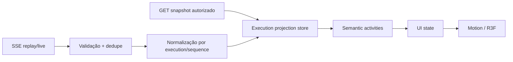

# Realtime Architecture

## Pipeline

## Protocolo cliente

1. Buscar snapshots autorizados das executions abertas.
2. Abrir um stream com conjunto explícito (máximo 64 IDs no request atual), salvar cursor por digest de seleção.
3. Processar cada `event_id` uma vez; só persistir o cursor após a projeção atômica.
4. Aplicar evento apenas se `state_version`/`sequence` não regredir a execution.
5. Em `CursorError`, 403/revogação, retenção vencida ou lacuna detectada: descartar cursor, refetch de snapshots, abrir stream novo.

O EventSource nativo não permite `POST` de abertura/autorização nem header Bearer. Implementar abertura via fetch e conexão SSE autenticada conforme sessão/cookie ou um transporte aprovado pelo backend; não colocar PAT em URL.

## Stores

- **TanStack Query**: snapshots HTTP, invalidação, erros e retries.
- **Zustand/reducer**: stream binding, dedupe LRU persistível, cursor e projections normalizadas.
- **Motion/R3F local**: valores transitórios; nunca gravar frame state no server store.

## Normalização

Entrada: envelope SSE. Saída: `ExecutionProjection`, `Activity`, `AgentGraphProjection`. Uma activity é idempotente por `event_id`, correlaciona `execution_id`, `causation_id`, `invocation_id` quando houver, e expira seus efeitos efêmeros. Se receber apenas lifecycle, criar activity lifecycle; se receber Tool event, nunca supor resultado visível; se receber delegation, atualizar grafo e rail.

## Pré-requisito de produção

O `InMemoryClientEventStream` atual é um adapter de teste e entrega o lote disponível + heartbeat. Antes do realtime de produto, criar adapter durável que consume archive/outbox autorizado, mantém retenção e alimenta a mesma semântica de cursor. Este frontend não deve contornar a porta lendo Redis/Postgres.
