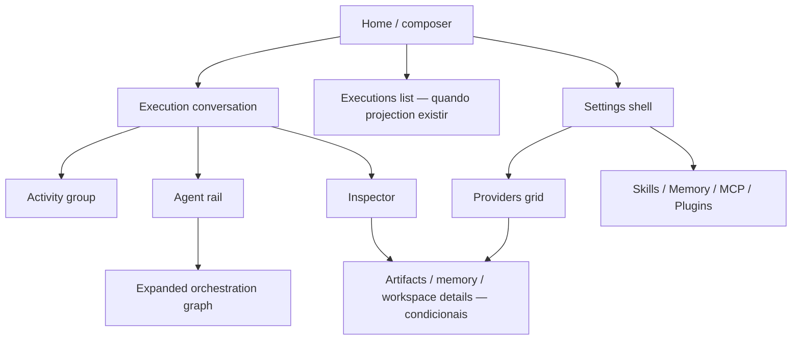

# Screen Map

| Tela | Objetivo | Disponibilidade inicial |
| --- | --- | --- |
| Home | iniciar ou selecionar uma task autorizada | Após command adapter. |
| Execution conversation | acompanhar lifecycle e resultado autorizado | Após query + result DTO + SSE bridge. |
| Activity disclosure | resumir operações | Após Tool projection. |
| Orchestration graph | explicar delegação observada | Após delegation query/stream. |
| Inspector | auditoria sob demanda | Incremental, por DTO disponível. |
| Settings shell | navegar pelas dez seções globais | `/settings/*`, com uma barra lateral única e cabeçalho consistente. |
| Providers grid | configurar/revogar provider | Cards baseados no catálogo real; `/settings/providers/:provider` abre a gaveta sem perder a grade. |
| Skills / Memory / MCP / Plugins | administrar extensões e memória | Conteúdo de seção dentro do shell, sem `app-shell`/`topbar` próprios. |
| Executions list | reencontrar trabalho | Após lista com schema/paginação. |

Navegação não cria uma tela de dashboard. Lista, settings e inspector são suporte à conversa; atividade e colaboração vivem no contexto da execution.

Aliases legados `/providers`, `/skills` e `/schedules` apontam para as rotas equivalentes em Settings. OmniRoute é um card de Providers; Agents continua no contexto do agente.
