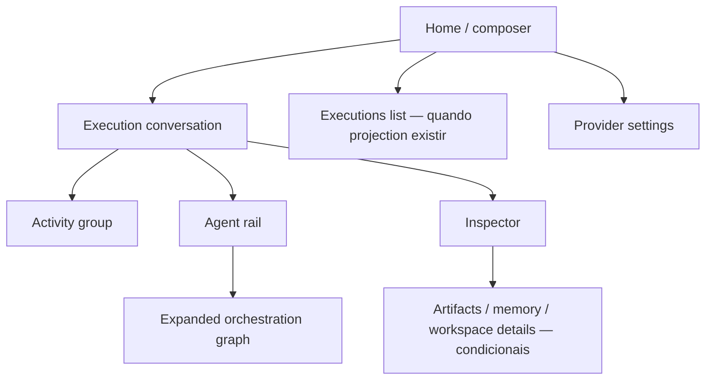

# Screen Map

| Tela | Objetivo | Disponibilidade inicial |
| --- | --- | --- |
| Home | iniciar ou selecionar uma task autorizada | Após command adapter. |
| Execution conversation | acompanhar lifecycle e resultado autorizado | Após query + result DTO + SSE bridge. |
| Activity disclosure | resumir operações | Após Tool projection. |
| Orchestration graph | explicar delegação observada | Após delegation query/stream. |
| Inspector | auditoria sob demanda | Incremental, por DTO disponível. |
| Provider settings | configurar/revogar provedor | UI atual sobre os endpoints e o adapter de provider compostos em produção. |
| Executions list | reencontrar trabalho | Após lista com schema/paginação. |

Navegação não cria uma tela de dashboard. Lista, settings e inspector são suporte à conversa; atividade e colaboração vivem no contexto da execution.
