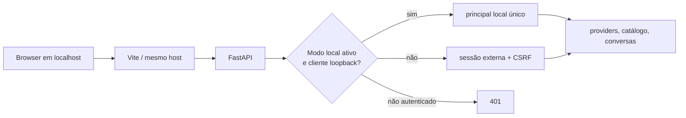

# Runtime local confiável — Design

**Data:** 2026-08-10  
**Status:** aprovado pelo usuário — implementação pendente

## Objetivo

Permitir que a aplicação seja usada pessoalmente em `localhost` sem login,
IdP, PAT no browser ou provisionamento manual de sessão, mantendo uma barreira
explícita para que esse atalho não possa ser levado por acidente à futura VPS.

## Decisão

Será criado um modo opt-in `LOCALHOST_TRUST_ENABLED=true`. Ele só é válido
quando `AGENTOS_ENV=development` ou `local`. Nesse modo, cada requisição
protegida recebe um único principal local de escopo `api`, mas apenas se a
conexão TCP chegar de `127.0.0.1` ou `::1`. Qualquer conexão fora do loopback
recebe 401, inclusive se o processo tiver sido iniciado acidentalmente em
`0.0.0.0`.

O modo não emite cookie, não usa sessão, não armazena tokens no browser e não
desabilita a autorização da aplicação. Ele elimina somente a dependência do
emissor externo de sessão para a instalação pessoal local. Como não há cookie
de autenticação, a proteção CSRF de sessão não se aplica; o cliente identifica
explicitamente esse bootstrap local e continua exigindo idempotência em
mutações.

`ProductionSettings` deve rejeitar a combinação em ambiente diferente de
`development`/`local`. A configuração padrão é desligada. A documentação de
VPS deve dizer para não defini-la e continuar usando sessão externa por cookie
mais CSRF por host/IdP.

## Alternativas consideradas

1. Senha local em `.env`: permite acesso remoto controlado, mas adiciona login,
   gestão de sessão e recuperação que a instalação pessoal não pediu.
2. Confiar em qualquer origem/host: é simples, porém um bind ou proxy errado
   transformaria a instalação em um serviço sem autenticação. Rejeitada.
3. Loopback com guarda dupla de configuração e IP: escolhido. É sem fricção
   para uso local e falha fechada fora da máquina.

## Fluxo

## Experiência web

O HTML terá uma meta não secreta que declara `auth-mode`. Em instalações
normais ela fica vazia e o bootstrap continua exigindo a meta CSRF injetada
pelo host. No ambiente local, o build Vite recebe `VITE_AUTH_MODE=loopback`,
publica `auth-mode=loopback`, e o cliente realiza as mutações sem
`X-CSRF-Token`. Não haverá alternância de modo em tempo de execução, token em
storage ou fallback silencioso em produção.

## Operação local

O runtime local terá um perfil/documentação que:

- sobe PostgreSQL e Redis com volumes persistentes;
- aplica Alembic antes de expor a API;
- liga FastAPI em `127.0.0.1:8000` e Vite em `127.0.0.1:4173`;
- configura `LOCALHOST_TRUST_ENABLED=true` e `VITE_AUTH_MODE=loopback`;
- mantém provider keys somente no banco, via tela de configurações.

O compose de infraestrutura continua restrito à máquina no caminho documentado;
nenhuma porta é anunciada como adequada para a VPS. A futura implantação deve
substituir apenas o bootstrap de autenticação, não os fluxos de provider ou
conversa.

## Critérios de aceite

- Com o perfil local, a home, Providers e conversa funcionam sem cookie/CSRF
  externos quando acessados do loopback.
- A mesma API chamada de endereço não-loopback é negada.
- O serviço não inicia com `LOCALHOST_TRUST_ENABLED=true` em staging/produção.
- O browser em modo normal continua requerendo cookie + CSRF; não há regressão
  no contrato anterior.
- Testes cobrem os dois modos, IPv4/IPv6 loopback, negação remota simulada,
  documentação e build/lint/suítes existentes.
